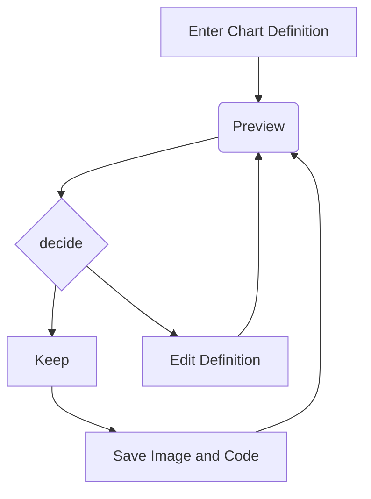

```memaid
architecture-beta
  group api(cloud)[API]

  service traefik(reverse-proxy)[Traefik] in api
  service caddy(frontend)[Caddy] in api
  service springboot(backend)[Spring Boot] in api
  service mongo(mongo-db)[MongoDB] in api

  traefik:L -- R:caddy
  traefik:L -- R:springboot
  springboot:L -- R:mongo
```


